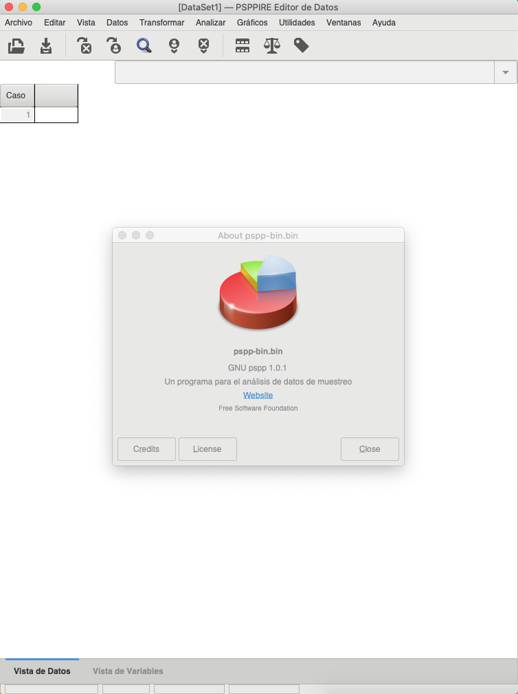

---
output:
  revealjs::revealjs_presentation:
    self_contained: false
    center: true
    theme: moon
    transition: zoom
---

# {data-background="ENC.jpg"}

# INTRODUCCIÓN {data-background="fd.jpg"}

SPSS es una **herramienta** que auxilia las distintas rutas de acción en la investigación social.

Es casi exclusiva para la investigación cuantitativa.

Su dominio depende del conocimiento estadístico que el usuario tenga, en cualquiera de sus niveles; los niveles son dos, 1) descriptivo y 2) inferencial.

# Objetivo del curso {data-background="fd.jpg"}

Entrenar de manera intensiva la utilización del software para procesamiento de datos y análisis estadístico SPSS en  la implementación de la  investigación social que implican la resolución de problemas estadísticos. 

# Estrategia de aprendizaje {data-background="fd.jpg"}

>* Se divide en tres momentos:
1. El planteamiento de un problema estadístico
2. El procesamiento de los datos
3. La obtención y análisis de resultados
>* Se plantean al menos un producto global por cada uno de los momentos
 
# Requisitos... {data-background="fd.jpg"}

 Para el desarrollo del curso-taller se requiere:
 
a.	Tener un equipo de cómputo portatil (laptop)
b.	Contar con datos que puedan procesarse. No es necesario que sean archivos del SPSS, pueden ser de Excel, archivos de texto (.txt) o de datos en otros formatos (CSV, DTA,DBASE) como los de las bases de datos que proporciona INEGI o algunos otros organismos.
c.	Disponibilidad de horario para asistir en un periodo de 9 de la mañana a 2 de la tarde durante cuatro sesiones.
d.	Cubrir la cuota correspondiente.

# Evaluación {data-background="fd.jpg"}

1. No hay una evaluación numérica, sin embargo si hay una entrega de evidencias que se van elaborando a lo largo del taller.
2. Se entregará una evidencia por cada uno de los tres momentos señalados en la estrategia de aprendizaje.

# Materiales y recursos {data-background="fd.jpg"}

Los recursos de literatura y software serán provistos por el facilitador.

## Tutorial de instalación SPSS 22 

<iframe width="1081" height="639" src="https://www.youtube.com/embed/PQIF-3h3qMU" frameborder="0" allow="accelerometer; autoplay; encrypted-media; gyroscope; picture-in-picture" allowfullscreen></iframe>

## La alternativa a **SPSS** ES **PSPP**

