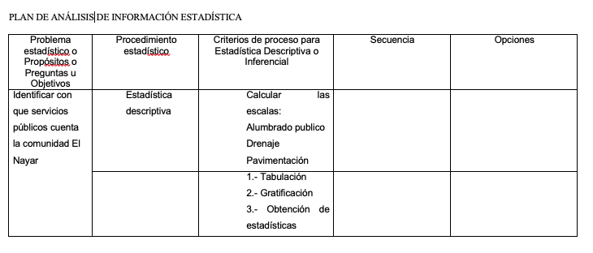

# {data-background="F/f.png"}

# El Desarrollo de la investigación {data-transition="zoom"}

*Depende de:*

>1. Tener una idea clara sobre lo que se quiere investigar
>2. Plantear un buen problema de investigación
>3. Tener objetivos de investigación claros

# Estos tres requisitos: {data-transition="zoom"}

>1. es una definición del qué
>2. Es Llevar del terreno de las ideas a la mesa de trabajo
>3. Es en concreto planificar para implementar

# Protocolo vs. proyecto de investigación

>1. El protocolo define una ruta crítica
>2. El desarrollo del proyecto implica una definición de instrumentos 

> a. Cronograma
> b. Plan de recolección
> c. Plan de análisis

# {data-background="F/f1.png"}

# Recordar que...

Un Cronograma ampliado va de los más general a lo más específico

> Pueden ir agregándose niveles de especificidad

*ACTIVIDAD GENERAL->NIVEL DE ESPECIFICIDAD 1->NIVEL DE ESPECIICIDAD2->....*

**TÓMESE EN CUENTA QUE ENTRE MÁS NIVELES DE ESPECIICIDAD HAY, MÁS COMPLEJA ES LA GESTIÓN Y CONTROL DEL CRONOGRAMA**
  
# {data-background="F/f3.png"}

# EL PLAN DE RECOLECCIÓN SE COMPONE DE:

1. Revisión documental de intrumentos
2. Determinación del tipo de información que se requiere para alcanzar el objetivo
3. Elección del tipo de instrumentos que se utilizarán
4. Determinación de población y muestra
5. Formulación de la estrategia de recolección, por ejemplo considerar:
  a. Tiempos
  b. Capacitación de encuestadores
  c. Rutas de levantamiento

# {data-background="F/f4.png"}
  

# El plan de análisis...

> Es una estructura que indica qué procedimientos técnicos (cuantitativos o cualitativos) se deben llevar a cabo, y cómo deben ser comprobados.

# Ejemplo:

# ¿Qué elementos tiene?

>1. Columna de objetivos o pregutnas
>2. Columna de procedimientos estadísticos
>3. Columna de Criterios de decisión
>4. Columna de secuencia (opcional)

# Otro ejemplo

**Objetivo*: *Analizar el la conducta sustentable de estudiantes de preparatoria en general y por grupos de género** 

|Objetivo|Procedimiento|Criterio de decisión|
|:---|:---|:---|
|Conducta sustentable en general|Estadística descriptiva|1. Tabulación, 2) Graficación y 3. Estadísticos de tendencia central|
|Conducta sustentable por grupo de Hombres y Mujeres|Pruebas de diferencia de medias (pruebas paramétricas *t student*) o de comparación de grupos (pruebas no paramétricas, *chi-cuadrada* o *prueba exacta de Fisher*)|1. comprobar normalidad (`Kolmogorov n > 50` o `shapiro-wilks n < 50`), 2. Elegir prueba paramétricas o no paramétricas, 3. Identificar niveles de significancia estadística (`valor p <= 0.05` los grupos asumen conductas diferentes y `valor p > 0.05` conductas similares entre grupos)|

  