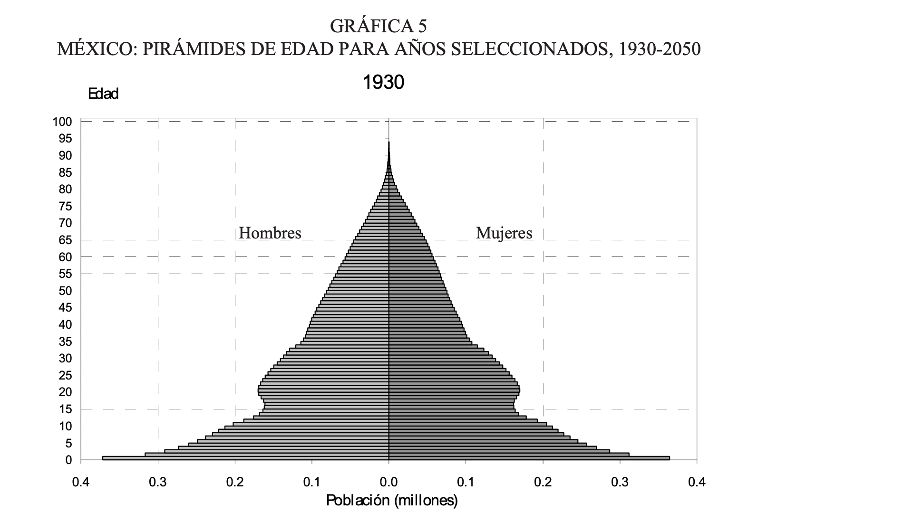
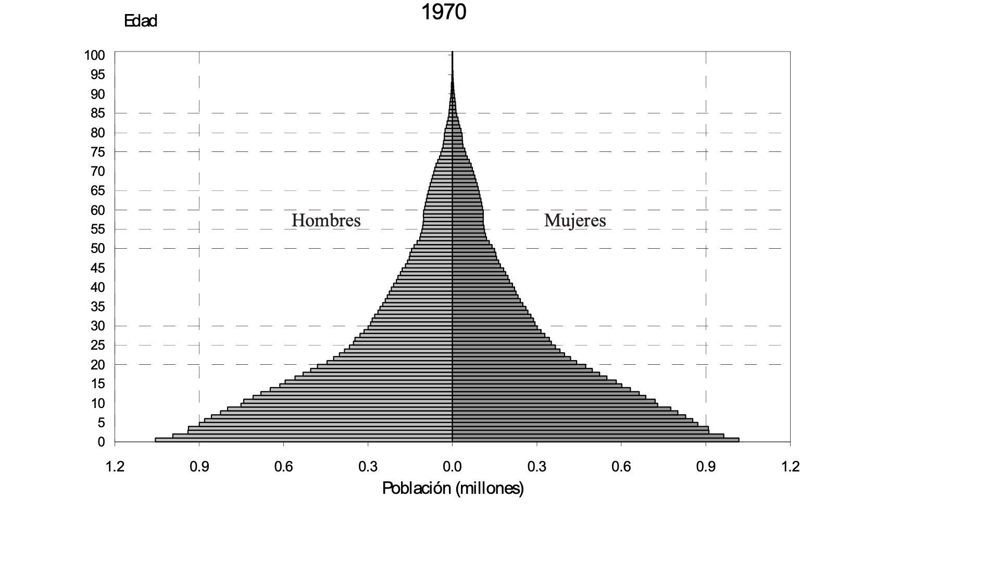
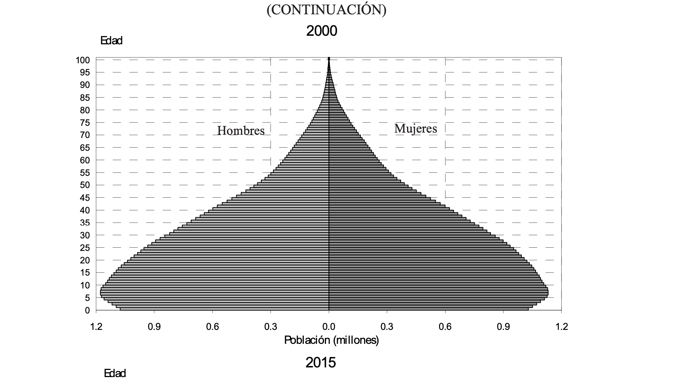
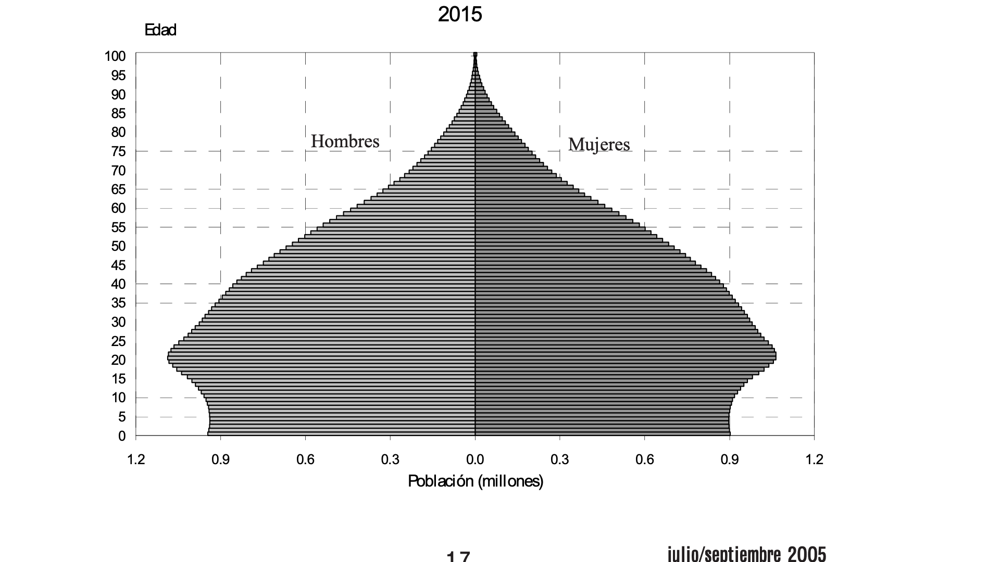
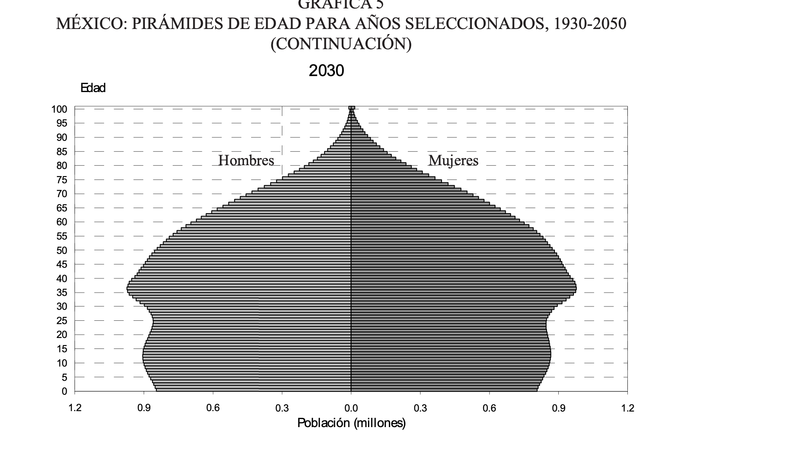
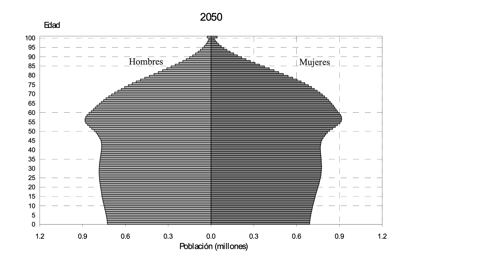
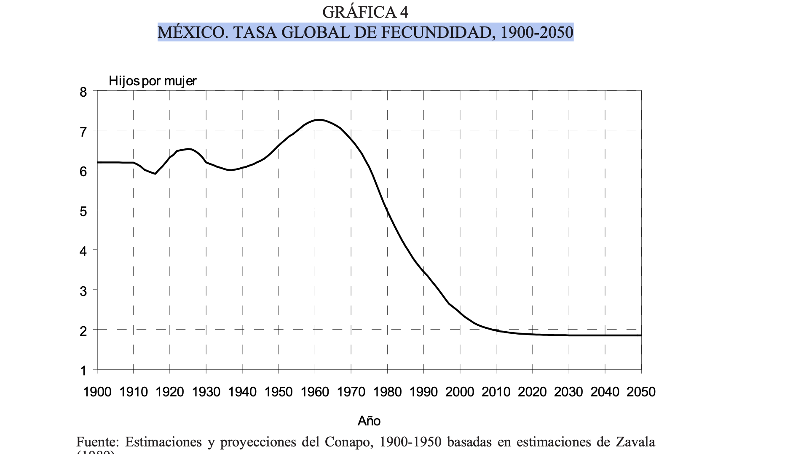

---
output:
  xaringan::moon_reader:
    css: 
      - xaringan-themer.css
      - "https://cdnjs.cloudflare.com/ajax/libs/animate.css/3.7.0/animate.min.css"
    lib_dir: libs
    includes:
      after_body: insert-logo.html
    nature:
      highlightStyle: solarized-light
      highlightLines: true
      countIncrementalSlides: false
      ratio: 16:9
    seal: false
---
background-image: url("img/fn.png")
background-size: contain
background-position: center
class: hide-logo, center, middle, animated, zoomIn

```{r xaringan-themer, echo=FALSE,include=FALSE,warning=FALSE}
library(xaringanthemer)
style_mono_dark(base_color = "#cbf7ed",
  header_font_google = google_font("Architects Daughter"),
  text_font_google   = google_font("Alegreya", "300", "300i"),
  code_font_google   = google_font("Hepta Slab")               
                )
```

## Políticas sociales y sociodemografía del envejecimiento
### UNIDAD 1: DIMENSIONES SOCIALES DEL ENVEJECIMIENTO
#### Algunos aspecos de la transición demográfica
*Dr. Jorge Enrique Bracanontes Grajeda*
---
class: center, middle,animated, zoomIn
## Efectos de la transición demográfica en la estructura poblacional
---
class: center, middle,animated, zoomIn
.pulse.animated[]
---
class: center, middle,animated, zoomIn

---
class: center, middle, animated, zoomIn


---
class: center, middle,animated, zoomIn


---
class: center, middle,animated, zoomIn

---
class: center, middle,animated, zoomIn

---
class: middle, center,animated, zoomInDown

||||
|:---:|:---:|:---:|
||||
||||
---
class: center, middle, animated, slideInRight



