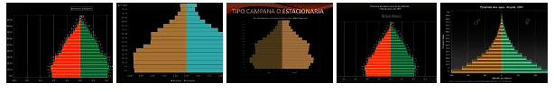
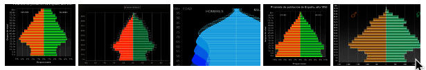

# Dinámica demográfica {data-audio-text="primera presentación"}

## Variables principales de la *dinámica demográfica*
Trata de los cambios diferenciales entre los grupos de población.

Son tres las variables centrales que ayuda a entender la llamada *dinámica demográfica*:

1.Fecundidad
2. Natalidad
3. mortalidad (y por ende natalidad)

## Concepto de dinámica demográfica ampliado

> La dinámica demográfica es el resultado del movimiento vital de las poblaciones y se relaciona tanto con las variaciones de la fecundidad, como con las condiciones de migración y de mortalidad. Las diferencias en la fecundidad y en la mortalidad por sectores socio-económicos acompañan l

# El envejecimiento poblacional

## ¿Qué es el envejecimiento poblacional?

Es el aumento de la proporción de adultos y ancianos un una población.

## Ejemplos de pirámides poblacionales

||
|:---:|
|ÍRÁMIDE DE POBLACIÓN JOVEN|
||
|PIRÁMIDE DE POBLACIÓN ENVEJECIDA|
||

