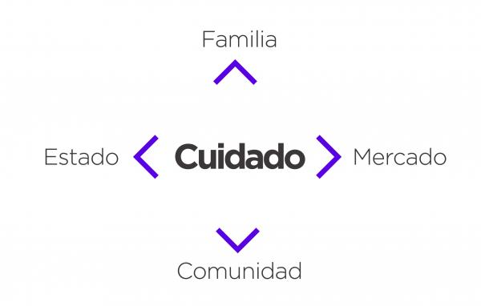
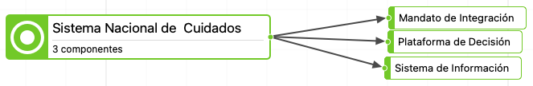

---
output:
  xaringan::moon_reader:
    css:
      - xaringan-themer.css
      - animate.min.css
    lib_dir: libs
    nature:
      highlightStyle: solarized-light
      highlightLines: true
      countIncrementalSlides: false
      ratio: 16:9
    seal: false
---
background-image: url(img/FND.png)
background-size: contain
background-position: center
class: inverse, hide-logo, center, middle, animated, zoomIn

```{r xaringan-themer, echo=FALSE,include=FALSE,warning=FALSE}
library(xaringanthemer)
style_xaringan(
  text_color = "black",
  text_font_google = google_font("poppins"),
  ,
  header_font_google = google_font("Montserrat"),
  header_color = "black"
)
```

## Sistema Nacional de Cuidados: un reto para la evaluación de políticas públicas desde lo local


### Dr. Jorge Enrique Bracamontes Grajeda

---
layout: true
background-image: url(img/FND1.png)
background-size: contain
class: animated, zoomIn, middle
---

<center><h1> Introducción: <i>la protección social</i></h1></center>
### En general los sistemas de protección social tienen dos pilares:

#### 1) Sistemas de Asistencia social  y  2) Sistemas de seguridad social

**Por medio de estos sistemas se atiende "lo público" y "lo social".**
---
# ¿...y qué con un Sistema Nacional de Cuidados?

## El cuidado se va tornando como el tercer pilar de la protección social: se le denomina "Sistema -Nacional de Cuidados"
---
# El cuidado debe considerarsecomo un DERECHO; a cuidar, a ser cuidado y al autocuidado
---
# El ejemplo uruguayo

<strong>
- Lo primero fue alcanzar un consenso acerca del cuidado como un derecho y una actividad social.
- Simultáneamente, los estudios del uso del tiempo hicieron visible la actividad del cuidado como una actividad feminizada, no remunerada y tampoco reconocida socialmente.
- El modelo del SNIC en Uruguay se basa en el ***diamante del cuidado***:
  + En un primer nivel busca la corresponsabilidad entre *familias, Estado, comunidades y el mercado*.
  + En un segundo nivel, busca la corresponsabilidad entre hombres y mujeres.
</strong>
  
---
# ...y también:

## El SNIC uruguayo está en etapa de consolidación después de alrededor de tres décadas de construcción.
---
# En el caso mexicano se construye una receta de dos etapas:

### 1) Se denomina *Estrategia Nacional de Cuidados (ENAC)*
### 2) De la ENAC, se deriva a un Sistema Nacional de Cuidados
---
# "El objetivo general de la estrategia es garantizar servicios de cuidado para la población en situación de dependencia que cumplan con los principios de accesibilidad, calidad y suficiencia."
---
# 3 Componentes


---
# 1. Mandato de integración

### Buscará incorporar dentro de una misma estructura las políticas públicas, programas y acciones situadas en las problemáticas del cuidado.
---
# 2. Plataforma de decisión

### Se trata de que haya una entidad que analice la situación del cuidado en lo específico-territorial y tome decisiones acerca de los mejores rumbos de las políticas públicas de cuidado. Se ha manejado la figura de Consejo Nacional de Cuiado.
---
# 3.  Sistema de información

### Debe ser un sistema que se mantenga al día respecto a la situación de la atención del cuidado, desde la propuesta de constitución del propio SNC, su implementación y seguimiento; todas estas etapas son susceptibles de evaluación.
---
# ¿Porqué el SNC es un reto para la evaluación?

1. Desde las definiciones de los sujetos de intervención o de atención.
2. Desde el punto de vista de quienes atienden.
3. Desde la multi-diversidad de situaciones, espacios y sujetos que cuidan o que son cuidados.
4. Desde considerar la multiplicidadd de instituciones, programas, políticas públicas, temáticas y ámbitos de atención e intervención.
---
# La evaluación debe plantearse en función de una construcción compleja y diversa, además de la consideración multidisciplinar.
---
# En lo inmediato:

1. Es necesario comenzar con el acopio de informaciones , datos cuantitativos y cualitativos para la construcción de la agenda local de cuidado.
2. Conjugar las voluntades políticas de las instituciones y actores a fin de potenciar las competencias técnicas, analíticas e intelectuales situadas en dirigir de forma adecuada la o las agendas locales de cuidado.
3. Tener siempre presente los aspectos de diversidad, multidisciplinariedad, complejidad, género y la perspectiva de derechos humanos. 
---
class: center

# ¡Muchas Gracias por sus Atenciones! :)